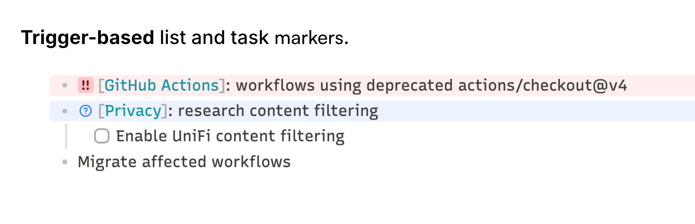
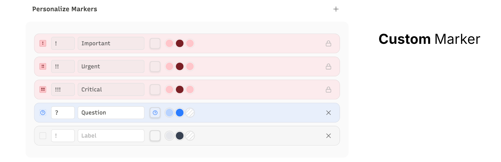

# Markr



Trigger-based list and task markers for [Obsidian](https://obsidian.md) — colored badges, line tints, and icons in Live Preview and Reading View. Inspired by [List Callouts](https://github.com/mgmeyers/obsidian-list-callouts) by mgmeyers.

## Features



Each marker is configured in settings — choose a trigger, label, Lucide icon, line color, and badge color independently.

- **Priority markers built in** — `!` Important, `!!` Urgent, `!!!` Critical, no setup required
- **Any trigger** — 1–3 characters on any list item becomes a colored badge with line tint
- **Command palette** — apply, remove, and cycle markers without touching the trigger text
- **Theme-safe** — composites over any Obsidian theme without hardcoded colors

## Install

**Manual:**

1. Download `main.js`, `styles.css`, and `manifest.json` from the [latest release](https://github.com/visua1hue/obsidian-markr/releases/latest)
2. Copy the files to `<vault>/.obsidian/plugins/markr/`
3. Enable Markr in **Settings → Community plugins**

**BRAT:**

```
visua1hue/obsidian-markr
```

Install [BRAT](https://github.com/TfTHacker/obsidian42-brat), add the repo above, then enable Markr in **Settings → Community plugins**.

## License

[MIT](LICENSE)
